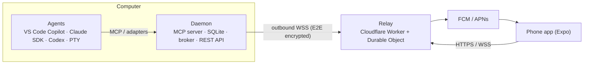

# Architecture

Contracts live in [packages/protocol/src/index.ts](../../packages/protocol/src/index.ts); this file explains the shape and the why.

## Components

| Component | Status | Responsibility |
|---|---|---|
| `packages/protocol` | done | Message envelope, chat/status types, MCP tool input/output schemas |
| `apps/daemon` | done (local) | MCP server, request lifecycle, history, desktop prompts, CLI |
| `apps/relay` | done (local) | Pairing rooms, encrypted message queue; later push fan-out and remote MCP endpoint (claude.ai/ChatGPT) |
| `apps/mobile` | scaffolded | Expo Android scaffold; chats, notifications, and approvals still planned |
| `docs/site` | static website | Product page and quick start; GitHub Pages Actions deploys this directory only |
| VS Code extension | phase 2 | Start chats from phone, window-focus presence |

## Data model
- **Chat**: `chat_id`, `source`, `title` (+`title_locked` after user rename), `status` = running | waiting_input | idle | stopped | error.
- **Envelope**: `{v, id(ULID), chat_id, seq, ts, sender, body}`; `seq` is per-chat and assigned by the daemon.
- **Bodies**: text, status, approval_request, approval_response, approval_resolved, chat_meta, presence.

## Approval lifecycle
`pending → answered | expired | cancelled`. Resolution is a compare-and-set in SQLite (first answer wins). Every resolution appends `approval_resolved` so all clients can withdraw stale prompts.

## Relay wire protocol
Contracts: [packages/protocol/src/relay.ts](../../packages/protocol/src/relay.ts), [crypto.ts](../../packages/protocol/src/crypto.ts).
- Connect `wss://<relay>/rooms/<room>/ws?role=daemon|phone`; first frame `{t:'auth', token}`; relay replies `ready` + `peer` status, then drains the queue.
- `{t:'send', data}` → relay stores for the other role and forwards as `{t:'msg', id, data}`; receiver replies `{t:'ack', id}` to delete.
- `data` = base64url(nonce ‖ secretbox(JSON app frame)).
- Daemon → phone: `chats` (upsert list + machine), `envelopes` (batch), `result` (ref to phone frame id).
- Phone → daemon: `sync` (per-chat cursors), `answer`, `say`, `rename`, `presence`; each has a ULID `id` for dedupe.

## Routing (target, needs relay)
1. Away toggle on, screen locked, or idle >2 min → phone immediately.
2. Otherwise prompt on desktop (MCP elicitation, fallback Windows toast); after 30s also push to phone. Both stay live; first answer wins.
3. Tool call returns `pending` after ≤55s; agent continues with `await_human_response`.

## Agent support
| Agent | Agent→phone | Phone reply | Phone starts chat |
|---|---|---|---|
| Claude Agent SDK / Codex SDK | yes | yes | yes |
| Any CLI (PTY wrapper) | yes (scraped) | yes (keystrokes) | yes |
| VS Code Copilot, Claude Desktop (MCP) | yes | while call is open | via VS Code extension only |
| claude.ai / ChatGPT (remote MCP) | yes | while call is open | no |

## Security model
- Daemon: loopback only, bearer token, Host allowlist.
- Relay: never sees plaintext; QR pairing exchanges keys; replies signed and idempotent.
- High-risk approvals require biometric unlock on phone; `command` always shown verbatim.

## Phases
1. Daemon + relay + Android app (VS Code via MCP) ← current
2. VS Code extension (new chat from phone), terminal view, stall nudge
3. Claude Agent SDK, Codex SDK, PTY adapters
4. Remote MCP connector, iOS, calls, full handover mode
